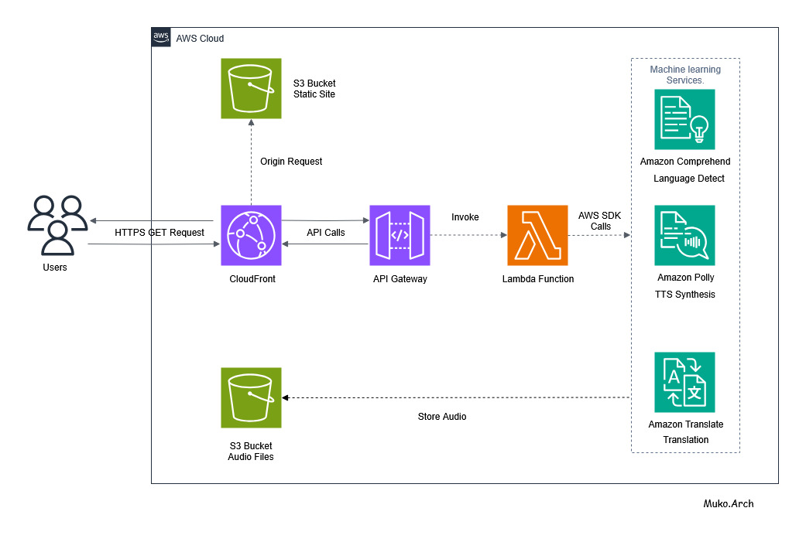
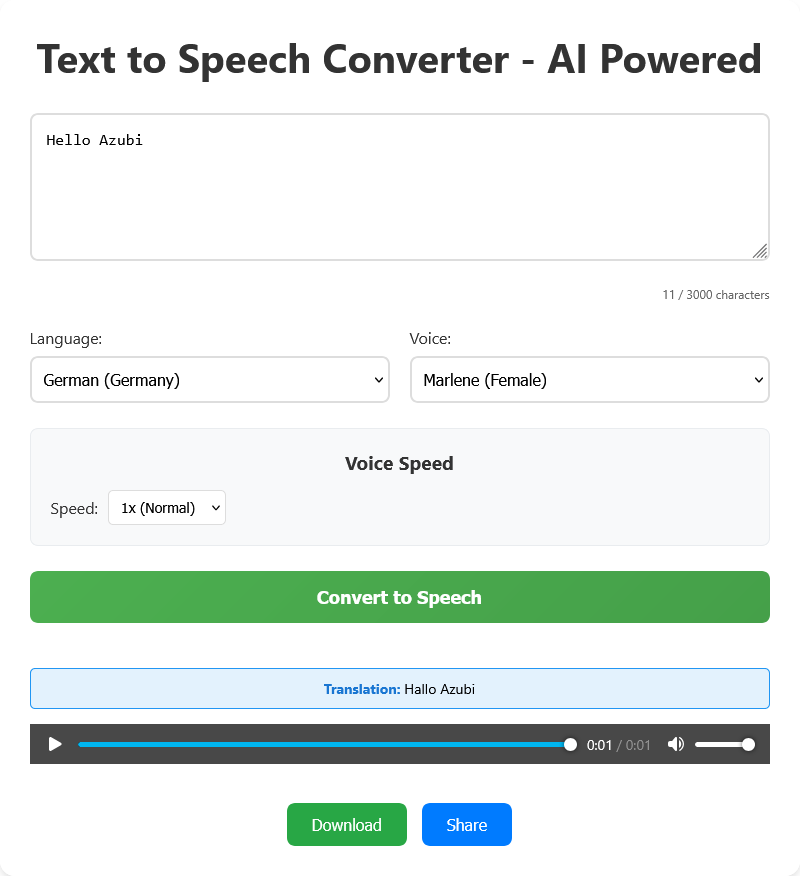

# Voice Synthesis App

## Talk Nerdy to Me 😂
*I don't always talk to computers, but when I do.. they talk back, thanks to this serverless TTS stack on AWS*

## Overview 
A serverless multilingual text-to-speech application built with AWS services. Convert text to natural-sounding speech with automatic translation and enterprise-grade security, the security scans were done with [Amazon Q](https://aws.amazon.com/q/)

## Architecture

### AWS Services Used:
- **Amazon S3**: Static website hosting & audio file storage
- **AWS Lambda**: Serverless compute for text processing
- **Amazon API Gateway**: RESTful API with CORS support
- **Amazon Polly**: Neural text-to-speech synthesis
- **Amazon Translate**: Automatic language translation
- **Amazon Comprehend**: Language detection
- **Amazon CloudFront**: Global CDN with HTTPS
- **AWS CloudFormation**: Infrastructure as Code
- **AWS IAM**: Security roles and policies

### Architecture Flow:


## Quick Deployment

### Prerequisites:
- AWS CLI installed and configured
- Python 3.9+ installed

### Automated Deployment:
```bash
# Cross-platform Python script
python setup.py

# Or make executable (Linux/Mac)
chmod +x setup.py
./setup.py
```

### Manual Deployment (All Platforms):

**1. Deploy Infrastructure:**
```bash
cd infrastructure
aws cloudformation deploy \
  --template-file template.yaml \
  --stack-name voicesynth-stack \
  --capabilities CAPABILITY_NAMED_IAM \
  --parameter-overrides ProjectName=voicesynth
```

**2. Package Lambda Function:**
```bash
cd ../backend
mkdir -p deployment
cp src/lambda_function.py deployment/
pip install -r requirements.txt -t deployment/
cd deployment
zip -r ../lambda-deployment.zip .
cd ..
```

**3. Update Lambda Function:**
```bash
aws lambda update-function-code \
  --function-name voicesynth-synthesize \
  --zip-file fileb://lambda-deployment.zip
```

**4. Deploy Frontend:**
```bash
cd ../frontend
# Get bucket name from CloudFormation
BUCKET_NAME=$(aws cloudformation describe-stacks \
  --stack-name voicesynth-stack \
  --query "Stacks[0].Outputs[?OutputKey=='WebsiteBucket'].OutputValue" \
  --output text)

# Update API endpoint in app.js
API_ENDPOINT=$(aws cloudformation describe-stacks \
  --stack-name voicesynth-stack \
  --query "Stacks[0].Outputs[?OutputKey=='ApiEndpoint'].OutputValue" \
  --output text)

sed -i "s|https://your-api-gateway-url.amazonaws.com/prod/synthesize|$API_ENDPOINT|g" app.js

# Upload to S3
aws s3 sync . s3://$BUCKET_NAME --delete --exclude "*.py"

# Clear CloudFront cache
DISTRIBUTION_ID=$(aws cloudfront list-distributions \
  --query "DistributionList.Items[?Origins.Items[0].DomainName=='$BUCKET_NAME.s3.us-east-1.amazonaws.com'].Id" \
  --output text)
aws cloudfront create-invalidation --distribution-id $DISTRIBUTION_ID --paths "/*"
```

## Project Structure
```
voicesynth-app/
├── .github/workflows/     # CI/CD automation
│   ├── deploy.yml        # Production deployment
│   └── test.yml          # Code validation
├── frontend/              # Static website (HTML/CSS/JS)
│   ├── index.html        # Main application interface
│   ├── app.js           # Frontend logic & API calls
│   ├── styles.css       # Application styling
│   └── deploy.py        # S3 deployment script
├── backend/              # Lambda function
│   ├── src/
│   │   └── lambda_function.py  # Polly + Translate integration
│   ├── requirements.txt # Python dependencies
│   └── deploy.py        # Lambda packaging script
├── infrastructure/       # AWS CloudFormation
│   ├── template.yaml    # Complete infrastructure definition
│   └── deploy.py        # Stack deployment script
├── .gitignore           # Version control exclusions
├── DEPLOYMENT.md        # CI/CD setup guide
├── SECURITY.md          # Security documentation
├── PROJECT_GUIDE.md     # Learning objectives
├── setup.py             # Cross-platform deployment orchestrator
└── README.md
```

## Features

### **Core Functionality**
- **Multilingual Support**: 8 languages (English, Spanish, French, German, Italian, Portuguese, Japanese)
- **Automatic Translation**: Input text in any language, get native speech
- **Neural Voices**: 18+ high-quality Amazon Polly voices
- **Speed Control**: Adjustable playback speed (0.5x - 2x)
- **Auto-play**: Instant audio playback after conversion
- **Download & Share**: Save audio files and share the app

### **Technical Features**
- **Serverless Architecture**: Pay-per-use, auto-scaling
- **HTTPS Security**: CloudFront CDN with SSL/TLS
- **Enterprise Security**: XSS protection, input validation, CORS
- **Responsive Design**: Works on desktop and mobile
- **Real-time Processing**: Fast text-to-speech conversion
- **Auto-cleanup**: Files expire after 7 days for cost optimization

## Configuration

### **Automatic Setup**
The app automatically configures:
- **S3 Buckets**: CORS settings, lifecycle policies, versioning
- **Lambda Function**: Polly, Translate, and Comprehend permissions
- **API Gateway**: CORS headers, rate limiting
- **CloudFront**: HTTPS enforcement, global CDN
- **IAM Roles**: Least-privilege access policies
- **Security**: Input validation, XSS protection, HTTPS-only

### **Supported Languages & Voices**
- **English (US)**: Joanna, Matthew, Ivy, Justin
- **English (UK)**: Amy, Brian, Emma
- **Spanish**: Lucia, Enrique
- **French**: Celine, Mathieu
- **German**: Marlene, Hans
- **Italian**: Carla, Giorgio
- **Portuguese**: Vitoria, Ricardo
- **Japanese**: Mizuki, Takumi

## Cost Optimization

### **Serverless Benefits**
- **No idle costs**: Pay only for actual usage
- **Auto-scaling**: Handles traffic spikes automatically
- **Efficient processing**: Lambda timeout optimized to 30 seconds

### **Storage Optimization**
- **Lifecycle policies**: Audio files auto-delete after 7 days
- **Presigned URLs**: 1-hour expiration for security
- **CloudFront caching**: Reduced origin requests
- **Compression**: Optimized file sizes

### **Estimated Costs** (Monthly)
- **Light usage** (100 conversions): ~$0.50
- **Medium usage** (1,000 conversions): ~$3.00
- **Heavy usage** (10,000 conversions): ~$25.00

*Costs include Lambda, Polly, Translate, S3, and CloudFront*

## Live Application

**Production URL**: https://d2nylb7v6suh5h.cloudfront.net



## CI/CD Pipeline

### **Automated Deployment**
- **GitHub Actions**: Automatic deployment on push to main
- **Testing**: Code validation and security scanning
- **Infrastructure**: CloudFormation stack management
- **Cache Management**: Automatic CloudFront invalidation

### **Setup CI/CD**
1. Fork/clone repository to GitHub
2. Add AWS credentials to GitHub Secrets
3. Push to main branch triggers deployment
4. Monitor deployment in Actions tab

## Troubleshooting

### **Common Issues**
- **"Missing Authentication Token"**: Use CloudFront URL, not API endpoint
- **"Failed to convert text"**: Check Lambda logs in CloudWatch
- **Translation not showing**: Clear browser cache or wait for CloudFront
- **Voice not available**: Some voices don't support neural engine (auto-fallback)

### **Deployment Issues**
- **Stack exists**: Delete existing CloudFormation stack before retry
- **Permissions**: Ensure AWS credentials have required permissions
- **Region**: Verify deployment in correct AWS region (us-east-1)

### **Performance**
- **Slow loading**: CloudFront propagation takes 5-15 minutes
- **Cache issues**: Use CloudFront invalidation to force updates
- **Audio quality**: Neural voices provide better quality than standard

## Monitoring

### **AWS CloudWatch**
- Lambda function logs and metrics
- API Gateway request/error rates
- S3 storage usage and costs

### **Application Metrics**
- Conversion success rates
- Popular languages and voices
- User engagement patterns

## Security

### **Implemented Protections**
- **HTTPS Enforcement**: All traffic encrypted
- **Input Validation**: XSS and injection prevention
- **CORS Policies**: Controlled cross-origin access
- **IAM Roles**: Least-privilege permissions
- **Content Security Policy**: Browser-level protection

### **Data Privacy**
- **No persistent storage**: Text not stored permanently
- **Auto-cleanup**: Audio files deleted after 7 days
- **Presigned URLs**: Temporary, secure access
- **No tracking**: No user data collection

## Contributing

1. Fork the repository
2. Create feature branch
3. Make changes with tests
4. Submit pull request
5. Automated CI/CD handles deployment

## License

MIT License, See [LICENSE](LICENSE) file for details